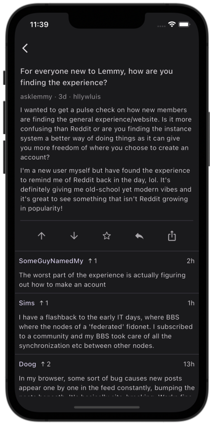
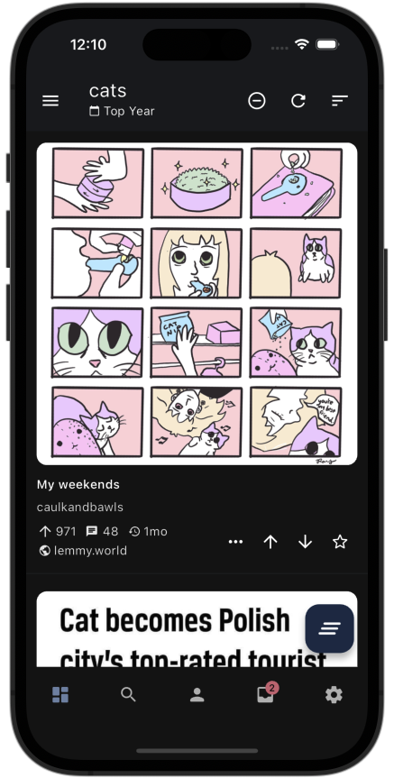
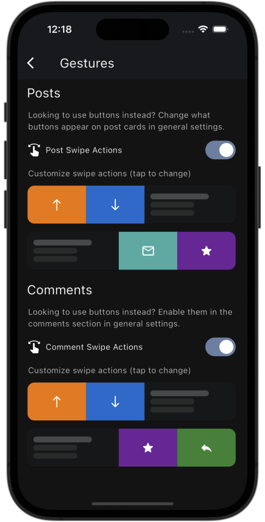

<p align="center">
  
</p>

<h1 align="center">Thunder</h1>

<p align="center">
    An open source, cross-platform (iOS & Android) Lemmy client built with <a href="https://flutter.dev/" target="_blank">Flutter</a>
</p>

<div align="center">
 <a href="https://apps.apple.com/iq/app/thunder-for-lemmy/id6450518497">
  
 </a>
 <a href="https://play.google.com/store/apps/details?id=com.hjiangsu.thunder">
  
 </a>
  <a href="https://apt.izzysoft.de/fdroid/index/apk/com.hjiangsu.thunder">
  
 </a>
 <a href="https://github.com/hjiangsu/thunder/releases/latest">
  
 </a>
</div>

<br />

<p align="center">
<a href="https://lemmy.world/c/thunder_app">
</a>
<a href="https://matrix.to/#/#thunderapp:matrix.org"></a>
</p>

<p align="center">
  <a href="#features">Features</a> •
  <a href="#roadmap">Roadmap</a> •
  <a href="#contributing">Contributing</a> •
  <a href="#translations">Translations</a> •
  <a href="#building-from-source">Building From Source</a> •
  <a href="#conventions">Conventions</a>
</p>

<div align="center">
  <br>
    
    
    
    
  <br>
</div>

<hr />
<p>
Hey there! Just wanted to let you know that this repo is currently my personal side project to build something cool while learning about Dart and Flutter.
</p>
<p>
Contributions to this project are always welcomed, and in fact, even strongly encouraged here! Since I am only able to work on this during my spare time, any contributions from the community is valuable. If you are a developer, feel free to tackle any issues present.
</p>
<p>
Your passion, contributions, and ideas would be greatly appreciated! Together, let's make this project shine. 🚀 💻
</p>
<hr />

## Releases

### Android

General releases can be obtained officially through [Google Play Store](https://play.google.com/store/apps/details?id=com.hjiangsu.thunder), [IzzyOnDroid](https://apt.izzysoft.de/fdroid/index/apk/com.hjiangsu.thunder), or through GitHub releases.

Pre-releases are available in the [Releases](https://github.com/hjiangsu/thunder/releases) section under the corresponding version. You can also use [Obtainium](https://github.com/ImranR98/Obtainium).

### iOS

General releases can be obtained officially through [App Store](https://play.google.com/store/apps/details?id=com.hjiangsu.thunder), or through GitHub releases.

Pre-releases are available through [TestFlight](https://testflight.apple.com/join/9n8xrqvH). An alternative is to download the corresponding IPA file in the [Releases](https://github.com/hjiangsu/thunder/releases) section and install it through [AltStore](https://altstore.io/).

## Features

Thunder is currently undergoing **active alpha development**, and it is possible that not all features have been fully implemented at this stage. Due to this, significant breaking changes may occur between versions.

This is a non-exhaustive list of features that Thunder currently supports:

#### 🏡 **Communities & Users**
- Browse general feeds (All / Local / Subscribed)
- View, subscribe, favorite, and block communities
- View user posts/comments, and block unwanted users

#### 🌎 **Instances**
- View instance information and version
- Block unwanted instances (on supported instances)

#### 🔎 **Search**
- Show trending communities on the current instance
- Search for communities, users, posts and comments
- Apply advanced search filters (sort, feed, community, creator)

#### 🗒️ **Posts & Comments**
- Create and edit posts and comments
- Vote, save, and share posts and comments
- Customize swipe actions for posts and comments
- Filter posts based on keywords

#### 🔑 **Accounts**
- View profile information (posts/comments/saved)
- View notifications including replies, mentions, and private messages
- Synced account settings (show read posts, comment scores, bot accounts)
- Support for multiple accounts, and guest accounts on different instances

#### 🎨 **Customization**
- Support for Material You theming (on applicable devices)
- Support for light/dark/OLED/system mode, and preset accent colors
- Custom font scaling of content
- Customize and preview post/comment appearance (compact/card)

#### 🎉 **Extras**
- Import and export app settings
- In-app update notifications for new GitHub releases
- Language support via community translations (Weblate)

## Roadmap

The current focus is to continue to expand on the general functionality and stability of Thunder. This includes but is not limited to:

- Continued improvements to localization and language support via Weblate
- Improvements to moderation/admin capabilities
- Improvements to embedded content (video, images, etc.)
- Improvements to push notification functionality

## Contributing

Contributions are always welcome, but please abide by our community [code of conduct](https://github.com/thunder-app/thunder/blob/develop/CODE_OF_CONDUCT.md)!

To contribute potential features or bug-fixes:

1. Fork this repository, and clone with submodules: `git clone --recurse-submodules -j8 git@github.com:thunder-app/thunder.git`
2. Base the feature or fix off the `develop` branch. This is to allow for pre-release versions without affecting the main general releases.
3. Apply any changes and/or additions based off an existing issue (or create a new issue for the feature/fix you are working on)
4. Create a pull request to have your changes reviewed and merged

## Translations
Interested in translating Thunder? We use [Weblate](https://hosted.weblate.org/engage/thunder/) to crowdsource translations, so anyone can create an account and contribute!

## Building From Source

### Installing Flutter and Related Dependencies

Thunder is developed with Flutter, and is built to support both iOS and Android. There may be unofficial support on other platforms but is not guaranteed at this time (Linux, Windows, MacOS)

To build the app from source, a few steps are required.

1. Set up and install Flutter. For more information, visit https://docs.flutter.dev/get-started/install.
2. Ensure that you are on Flutter's `stable` channel using `flutter channel stable`.
2. Clone this repository and fetch the dependencies using `flutter pub get`
4. Run `flutter gen-l10n` to generate the localization files.
5. Optional: Run the build script using `dart scripts/build.dart`, which will build both the iOS and Android release versions. This step is only required if you want to build a release version of the app.

### Building with Docker

Alternatively, you can skip the prerequisite setup and build the Android application via docker with a single command:

```bash
./scripts/docker-build-android.sh
```

#### Developing with Docker

You can also run your local development environment for Android via the Docker container, including connecting to ADB on the host machine.

```
./scripts/docker-dev-android.sh
```

### Troubleshooting

```shell
Could not determine the dependencies of task ':unifiedpush_android:compileReleaseKotlin'.
> Cannot find a Java installation on your machine matching this tasks requirements: {languageVersion=8, vendor=any, implementation=vendor-specific}
   > No locally installed toolchains match and toolchain download repositories have not been configured.
```

Resolution: Ensure you have a valid Java 8 installation on your machine.

## Conventions

While there are no specific conventions that must be followed, do try to follow best practices whenever possible.

Suggestions are always welcome to improve the code quality and architecture of the app!
